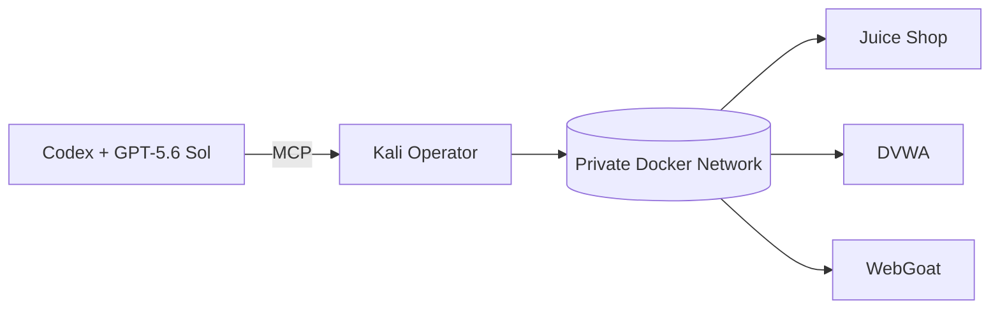

# thewire1o1

Security engineering, systems, automation, and hands-on lab work.

## Featured build: AI Security Lab

A reproducible GitHub Codespaces security workstation with:

- Mission Control web GUI
- disposable Kali Rolling operator container
- Codex + MCP integration
- OWASP Juice Shop, DVWA, and WebGoat training range
- Metasploit and focused offensive/security tooling
- Nmap + Nuclei evidence pipeline
- HTML/JSON reporting
- Trivy and Gitleaks CI checks

### Architecture

### Current focus

Building reproducible security research environments where the infrastructure, tooling, evidence, and AI-assisted workflows live together instead of becoming a pile of one-off machines and scripts.

[Security-Lab](https://github.com/thewire1o1/Security-Lab)
