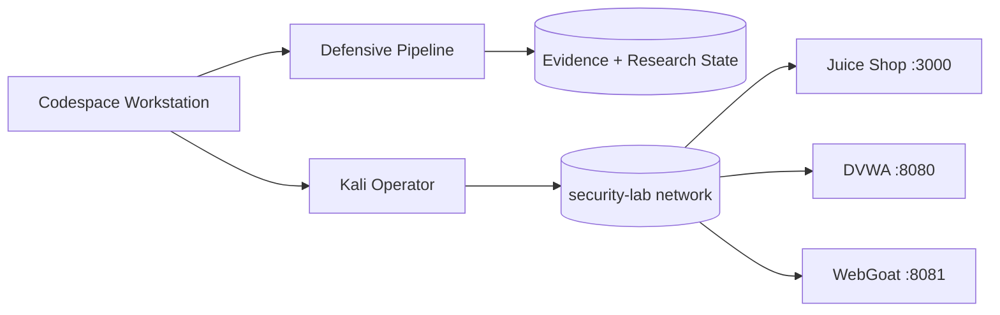

# Security Lab

[](https://github.com/thewire1o1/Security-Lab/actions/workflows/ci.yml)

Cloud-native security research workstation for GitHub Codespaces with isolated vulnerable training targets, a disposable Kali operator layer, continuous application-security checks, persistent research cases, artifact triage, bounded fuzzing, validation, evidence collection, and a live Mission Control interface.

## Mission Control

```bash
source ~/.bashrc
sec up
sec gui
```

Mission Control runs on `127.0.0.1:8765`. In Codespaces, open forwarded port **8765** and keep its visibility **Private**.

The dashboard includes live service telemetry, defensive-pipeline status, finding severity totals, research-case counts, tool inventory, run history, and allowlisted local actions.

## Defensive pipeline

```bash
sec defend
```

A full run performs:

1. environment and repository inventory
2. static application-security review
3. secret and configuration scanning
4. dependency and filesystem checks where applicable
5. bounded fuzzing of local training targets and custom harnesses
6. comparison with the previous review baseline
7. optional external review through a locally configured command

Artifacts are stored in timestamped `reports/defense-*` directories.

Individual stages can be run directly:

```bash
sec review
sec validate
sec fuzz
```

## Artifact triage

```bash
sec triage path/to/sample
```

Static triage records hashes, file identification, metadata where available, printable strings, binary structure output, embedded-content discovery, and YARA results when local rules exist. The triage command does not execute the supplied file.

## Research cases

```bash
sec research new parser-review
sec research note parser-review "Reproduced malformed input crash"
sec research task parser-review "Minimize crashing input"
sec research status parser-review
```

Cases persist under `cases/` with notes, tasks, evidence, output, and state metadata.

## Custom fuzz harnesses

Executable files placed under `fuzz/harnesses/` are discovered automatically by `sec fuzz`. Each harness receives a bounded execution window and its output is stored with the fuzz run.

## Architecture



## Control surface

```text
sec doctor                 health check
sec up                     start local vulnerable lab
sec down                   stop lab
sec ps                     container status
sec scan                   Nmap + Nuclei scan of local lab
sec gui                    Mission Control web interface
sec report                 HTML + JSON report from latest lab scan
sec defend                 complete defensive pipeline
sec review                 repository security review
sec validate               compare current findings with baseline
sec fuzz                   bounded local fuzzing
sec triage FILE            static artifact triage
sec research ...           persistent research-case management
sec engine [FILE]          optional external review hook
sec kali-build             refresh Kali operator image
sec kali                   enter Kali operator shell
sec new NAME               create engagement workspace
sec update                 update tools and templates
sec update --full          update and refresh Kali
```

## Local training targets

| Target | Local URL |
| --- | --- |
| OWASP Juice Shop | `http://127.0.0.1:3000` |
| DVWA | `http://127.0.0.1:8080` |
| WebGoat | `http://127.0.0.1:8081` |

## Operator stack

The Kali image contains a focused web, network, identity, reverse-engineering, triage, and fuzzing toolset. Highlights include Metasploit, BloodHound, Impacket, enum4linux-ng, Evil-WinRM, ExploitDB, Ligolo-ng, PEASS, Recon-ng, SecLists, testssl.sh, WhatWeb, WAFW00F, WPScan, tshark, Trivy, Gitleaks, YARA, radare2, Binwalk, GDB, AFL++, Clang, and LLVM.

## CI

Every pull request validates Python and shell syntax, runs ShellCheck, validates Docker Compose, scans repository history with Gitleaks, scans files and configuration with Trivy, and runs Semgrep and Bandit static analysis.

## Scope

This repository is built for isolated training targets and authorized security research. Default services bind locally and the browser control surface accepts only fixed server-side actions.
