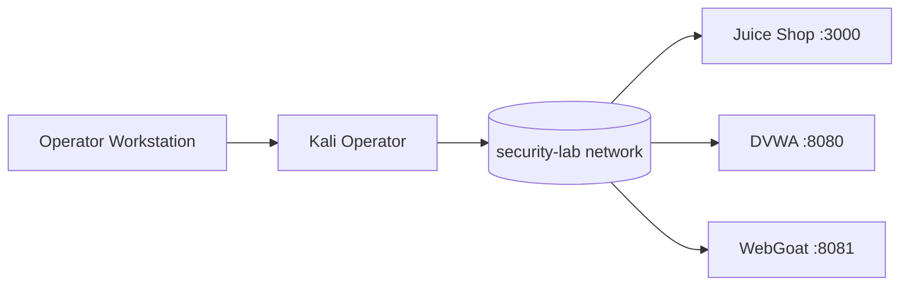

# Security Lab

[](https://github.com/thewire1o1/Security-Lab/actions/workflows/ci.yml)

Cloud-native security research workstation for GitHub Codespaces with a disposable Kali operator layer, isolated vulnerable training targets, automated evidence collection, and a live Mission Control GUI.

## Mission Control

```bash
source ~/.bashrc
sec up
sec gui
```

Mission Control runs on `127.0.0.1:8765`. In Codespaces, open forwarded port **8765** and keep its visibility **Private**.

The dashboard includes:

- live Juice Shop, DVWA, WebGoat, and Kali status
- container CPU and memory telemetry
- animated lab topology
- allowlisted Start / Stop / Scan / Report actions
- Nuclei severity totals and scan history
- host security-tool inventory
- live activity console
- responsive phone/tablet/desktop layout

## Architecture



The Codespace host stays relatively clean. Heavy operator tooling lives in a disposable Kali Rolling container attached to the same private Docker network as the intentionally vulnerable training targets.

## Control surface

```text
sec doctor       health check
sec up           start local vulnerable lab
sec down         stop lab
sec ps           container status
sec scan         Nmap + Nuclei scan of local lab
sec gui          Mission Control web GUI
sec report       HTML + JSON report from latest scan
sec kali-build   build/update Kali operator image
sec kali         enter Kali operator shell
sec new NAME     create engagement workspace
sec update       update tools/templates
sec update --full update and rebuild Kali
```

## Local training targets

| Target | Local URL |
| --- | --- |
| OWASP Juice Shop | `http://127.0.0.1:3000` |
| DVWA | `http://127.0.0.1:8080` |
| WebGoat | `http://127.0.0.1:8081` |

## Evidence and reporting

```bash
sec scan
sec report
```

Scan artifacts are stored under `reports/lab-*`. `sec report` produces `reports/mission-control-report.html` and a machine-readable JSON companion.

## Operator stack

Kali includes the focused security stack described in [SECURITY-LAB.md](SECURITY-LAB.md), including Metasploit, NetExec, Responder, BloodHound, Impacket, enum4linux-ng, Evil-WinRM, ExploitDB, Ligolo-ng, PEASS, Recon-ng, SecLists, testssl.sh, WhatWeb, WAFW00F, WPScan, tshark, Trivy, and Gitleaks.

## CI

Every pull request validates Python and shell syntax, validates the Docker Compose definition, runs Gitleaks, and runs a Trivy filesystem scan for high/critical vulnerabilities, secrets, and misconfiguration.

## Public showcase

A static showcase is ready under [`docs/`](docs/) for GitHub Pages. Pages must be enabled in repository settings before it becomes publicly served.

## Scope

This repository is built for isolated training targets and authorized security research. The default lab services and Mission Control bind locally rather than publishing the operator surface directly.
