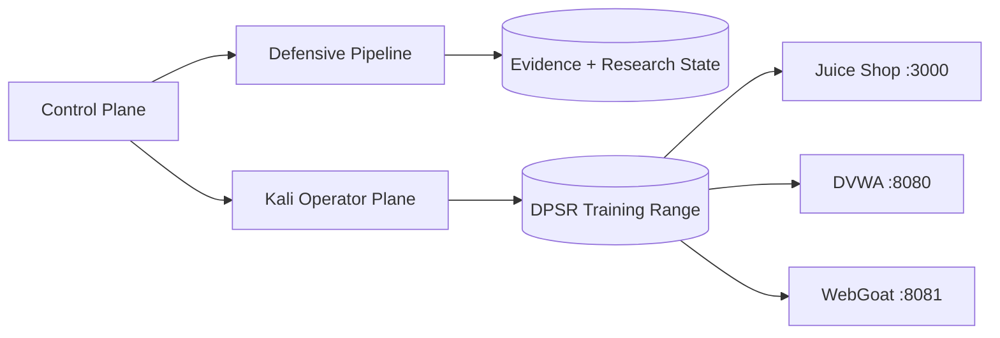

# Digital Paragon Security Research

[](https://github.com/thewire1o1/Security-Lab/actions/workflows/ci.yml)

**DPSR** is a reproducible security-research environment maintained by **TheWire1o1**. It combines an isolated vulnerable training range, a disposable Kali operator plane, continuous application-security analysis, bounded fuzzing, static artifact triage, persistent research state, evidence generation, and a private operations console.

The environment is intentionally opinionated: control-plane actions are allowlisted, vulnerable services bind to loopback, the training network is isolated from external egress, runtime evidence stays out of source control, and security checks run continuously in CI.

## Operating model

```bash
source ~/.bashrc
dpsr doctor
dpsr up
dpsr defend
dpsr gui
```

`dpsr` is the public control surface. The lower-level `sec` entry point remains available for compatibility.

## Trust boundaries

DPSR separates four concerns:

1. **Control plane** — local orchestration, state collection, reporting, and the operations console.
2. **Operator plane** — disposable Kali tooling with explicit network capabilities.
3. **Training range** — intentionally vulnerable applications on an internal Docker network.
4. **Evidence plane** — reports, case state, triage output, and validation artifacts kept outside normal source tracking.

The browser console exposes fixed server-side actions only. It does not accept arbitrary shell commands.

## Defensive pipeline

```bash
dpsr defend
```

A defensive run performs environment inventory, repository analysis, secret and configuration scanning, dependency/filesystem checks where applicable, bounded fuzzing, baseline comparison, and optional external review through a locally configured command.

Run individual stages directly when isolating a finding or validating a change:

```bash
dpsr review
dpsr validate
dpsr fuzz
```

Artifacts are written to timestamped `reports/defense-*` directories.

## Static artifact triage

```bash
dpsr triage path/to/sample
```

Triage records cryptographic hashes, file identification, filesystem metadata, printable strings, binary structure, embedded-content discovery, and YARA results when local rules are available. Supplied artifacts are inspected statically and are not executed.

## Research cases

```bash
dpsr research new parser-review
dpsr research note parser-review "Reproduced malformed-input crash"
dpsr research task parser-review "Minimize crashing input"
dpsr research status parser-review
```

Cases persist under `cases/` with explicit state, notes, tasks, evidence, and output directories so research survives terminal sessions and can be reproduced later.

## Custom fuzz harnesses

Executable harnesses placed under `fuzz/harnesses/` are discovered by `dpsr fuzz`. Each harness runs within a bounded execution window and writes output into the current fuzz run.

## Architecture



See [ARCHITECTURE.md](ARCHITECTURE.md) for the security model, invariants, and component boundaries.

## Control surface

```text
dpsr doctor                 validate local dependencies and runtime state
dpsr up                     start intentionally vulnerable training targets
dpsr down                   stop the training range
dpsr ps                     show container state
dpsr scan                   scan the local training range
dpsr gui                    launch the private operations console
dpsr report                 generate HTML/JSON evidence from the latest scan
dpsr defend                 execute the complete defensive pipeline
dpsr review                 run repository security analysis
dpsr validate               compare current findings with the previous baseline
dpsr fuzz                   run bounded local fuzzing and custom harnesses
dpsr triage FILE            perform static artifact triage
dpsr research ...           manage persistent research cases
dpsr engine [FILE]          invoke the configured external review hook
dpsr kali-build             refresh the Kali operator image
dpsr kali                   enter the Kali operator shell
dpsr new NAME               create an engagement workspace
dpsr update                 update host tools and templates
dpsr update --full          update tools and refresh the Kali image
```

## Training range

| Target | Local URL |
| --- | --- |
| OWASP Juice Shop | `http://127.0.0.1:3000` |
| DVWA | `http://127.0.0.1:8080` |
| WebGoat | `http://127.0.0.1:8081` |

## Operator stack

The Kali image contains a focused web, network, identity, reverse-engineering, triage, and fuzzing toolset. Notable components include Metasploit, BloodHound, Impacket, enum4linux-ng, Evil-WinRM, ExploitDB, Ligolo-ng, PEASS, Recon-ng, SecLists, testssl.sh, WhatWeb, WAFW00F, WPScan, tshark, Trivy, Gitleaks, YARA, radare2, Binwalk, GDB, AFL++, Clang, and LLVM.

## Continuous validation

Every pull request compiles the Python package, runs the unit suite, validates shell syntax with ShellCheck, validates Docker Compose, scans for credentials with Gitleaks, scans files and configuration with Trivy, and runs Semgrep and Bandit static analysis.

## Scope

DPSR is designed for isolated training targets, owned systems, and explicitly authorized security research. Default application bindings remain local and the operator/training network boundary is defined in source so it can be reviewed like any other security-sensitive control.
